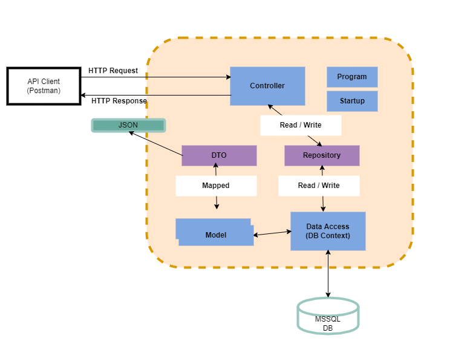

# commandline-api
Based on <b>Les Jackson</b> tutorial.

 See: <a href="https://www.youtube.com/watch?v=fmvcAzHpsk8&t=25s">link</a> 

## To run
        dotnet run

API is listening on:
https://localhost:5001/api/Commands

# Architecture 

# endpoints

| URL | Verb | Opeeration | Description | Success | Failure|
|:----|:-----|:-----------|:------------|:--------|:-------|
|/api/commands|GET| READ| Read all resources| 200 OK| 400 Bad Request   404 Not Found|
|/api/commands/{id}|GET| READ| Read a single resource| 200 OK| 400 Bad Request   404 Not Found|
|/api/commands|POST| CREATE| Create a new resources| 201 Created| 400 Bad Request   405 Not Allowed|
|/api/commands/{id}|PUT| UPDATE| Update an entire resources| 204 No Content| - |
|/api/commands/{id}|PATCH| UPDATE| Partial update a resources| 204 No Content| - |
|/api/commands/{id}|DELETE| DELETE|Delete a single resource| 200 Ok  204 No Content| - |

# How To
## 1.  Patch (partial update)

    [
        {
            "op": "replace",
            "path": "/path",
            "value": "value to path"
        },
        {
            "op": "replace",
            "path": "/line",
            "value": "_SERVER.data"
        }
    ]
